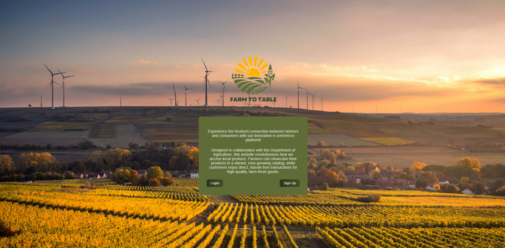

# FARM-TO-TABLE PROJECT
Farm-to-Table is an e-commerce platform designed to enable direct transactions between farmers and consumers. This platform, facilitated and overseen by the Department of Agriculture (DA), eliminates intermediaries, allowing farmers to sell their produce directly to end consumers. By bridging this gap, Farm-to-Table not only ensures fresher products for consumers but also provides farmers with fairer prices and improved market access.

The initiative aims to promote sustainable agriculture, empower local farmers, and create a transparent, efficient marketplace that benefits both producers and buyers.

## **PROJECT FEATURES**

### 1. User Types
- **Customers (Registered Users)**: Can register with an email, log in, and make purchases. 
- **Department of Agriculture (DA)**: Admin user with full control over product listings, orders, and sales reports. No registration required, as they are pre-assigned as merchants.

### 2. Login/Logout
- Customers must log in to access the platform.
- Admin has secure access to the admin dashboard, with protected routes.

### 3. E-Commerce Management (Admin)
- **User Management**: Admin can view and manage registered users.
- **Product Listings**: Admin can manage product details, inventory, and sorting by name, price, etc.
- **Order Fulfillment**: Admin confirms orders for delivery.
- **Sales Reports**: Admin can generate weekly, monthly, and annual sales summaries.

### 4. Shop Features (Customer)
- **Product Listings**: Customers can browse and filter products by name, type, price, and quantity.
- **Shopping Cart**: Add, delete, and manage cart items. View total price and item count.
- **Order Management**: Place orders and cancel orders before confirmation.

## **USAGE GUIDELINES**

## **Landing Page**
Welcome to the platform!
- Users can either **Login** or **Sign Up** to access the system.



---

## **Admin/Merchant Page**

### **Login Credentials**
To access the Admin page, use the following credentials:
- **Username:** `admin`
- **Password:** `admin`

### **Admin Dashboard Features**
Upon successful login, the admin will be directed to the dashboard with the following features:

1. **Users Page**
   - View a list of registered users.
   - Access user details and related information.
   
2. **Transactions Page**
   - View and manage pending orders.
   - Confirm orders submitted by users.
   
3. **Sales Report Page**
   - Monitor completed transactions.
   - View total income and income summaries:
     - Weekly income
     - Monthly income
     - Yearly income
   
4. **Add Product Page**
   - Add new products to the system.
   
---

## **User/Customer Page**

### **Product Viewing and Shopping**
1. Upon logging in, users will see a **list of products**.
2. Products can be **added to the cart**.
3. The cart can be accessed via the **Checkout button** located in the lower right corner.


### **Order Management**
- After checking out, users can track their orders through the **Order Page**.
- Orders can be navigated through the following statuses:
   - **Pending**
   - **Completed**
   - **Cancelled**

---

## **HOW TO RUN**

### **1. Setup the Database**

To set up the database:

1. Open **MongoDB** and connect using the URI:  
   `mongodb://localhost:27017`
   
2. **Create a Database** named:  
   `PROJECT`

3. **Create the following Collections**:
   - **Products** collection
   - **Users** collection
   - **Transactions** collection

> **Note**: MongoDB is case-sensitive. Ensure the collection names are exactly as specified.

4. For testing purposes, import the **`test_products.csv`** file (found in the **assets** folder) into the **`Products`** collection.

---

### **2. Run the Database**

To run the database:

1. Ensure **MongoDB** is installed and running on your system.

2. Open a new terminal and navigate to the **webserver** directory:
   ```bash
   cd webserver
   ```

3. Install the necessary dependencies:
   ```bash
   npm i
   ```

4. Start the webserver:
   ```bash
   node index.js
   ```
> **Note**: Wait for the webserver to print `MongoDB connected` before proceeding to step 3.

---

### **3. Run the Frontend**

To run the frontend:

1. Open a new terminal and navigate to the **frontend** directory:
   ```bash
   cd frontend
   ```

2. Install the necessary dependencies:
   ```bash
   npm i
   ```

3. Start the frontend server:
   ```bash
   npm run dev
   ```

---

## **SCREENSHOTS**


## **[ EF-1L ] AXIS**
Pabico, Kaye Chantal <br>
Rada, Lois <br>
Tolentino, Vinly <br>
Victoria, Jan Clarisse
